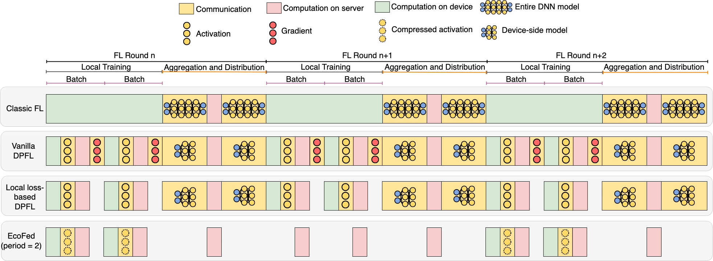

# EcoFed: Efficient Communication for DNN Partitioning-based Federated Learning

### About the research
Efficiently running federated learning (FL) on resource-constrained devices is challenging since they are required to train computationally intensive deep neural networks (DNN) independently. DNN partitioning-based FL (DPFL) has been proposed as one mechanism to accelerate training where the layers of a DNN (or computation) are offloaded from the device to the server. However, this creates significant communication overheads since the intermediate activation and gradient need to be transferred between the device and the server during training.

While current research reduces the communication introduced by DNN partitioning using local loss-based methods, we demonstrate that these methods are ineffective in improving the overall efficiency (communication overhead and training speed) of a DPFL system. This is because they suffer from accuracy degradation and ignore the communication costs incurred when transferring the activation from the device to the server. 

We proposes EcoFed - a communication efficient framework for DPFL systems. EcoFed eliminates the transmission of the gradient by developing pre-trained initialization of the DNN model on the device for the first time. This reduces the accuracy degradation seen in local loss-based methods. In addition, EcoFed proposes a novel replay buffer mechanism and implements a quantization-based compression technique to reduce the transmission of the activation. Figure 1 illustrates the training pipeline of classic FL, vanilla DPFL, local loss-based DPFL and EcoFed.

<b>Fig.1 The training pipeline of classic FL, vanilla DPFL, local loss-based DPFL and EcoFed for three rounds of training. Classic FL transfers the entire model from the devices to the server at the end of each round. Vanilla DPFL only needs to upload a partitioned device-side model at the end of each round. However, Vanilla DPFL transfers the activation and gradient for each batch sample. Local loss-based DPFL reduces the communication by half since the gradients are computed locally. EcoFed reduces communication further as it transfers the activation only periodically (for example, once in two rounds) and further compresses the size of the activations.</b>

It is experimentally demonstrated that EcoFed can reduce the communication cost by up to 133x and accelerate training by up to 21x when compared to classic FL. Compared to vanilla DPFL, EcoFed achieves a 16x communication reduction and 2.86x training time speed-up.

Details of EcoFed can be found in our preprint article entitled, [EcoFed: Efficient Communication for DNN Partitioning-based Federated Learning](https://arxiv.org/pdf/2304.05495.pdf), Arxiv, 2023. The final version is under review of TPDS.

### Code Structure
The repository contains the source code of EcoFed. The overall architecture is divided as follows:

- EcoFed
  - core
    - server - Code for server object 
    - client - Code for client object
    - pretraining - Code for centralized pretraining 
    - data_generator - Code for I.I.D. and Non-I.I.D. data generator
    - client_sampler - Code for client sampler of each round

The code currently supports two modes: centralized simulation and real distributed training.

### Setting up the environment
TBD

### Citation
TBD
